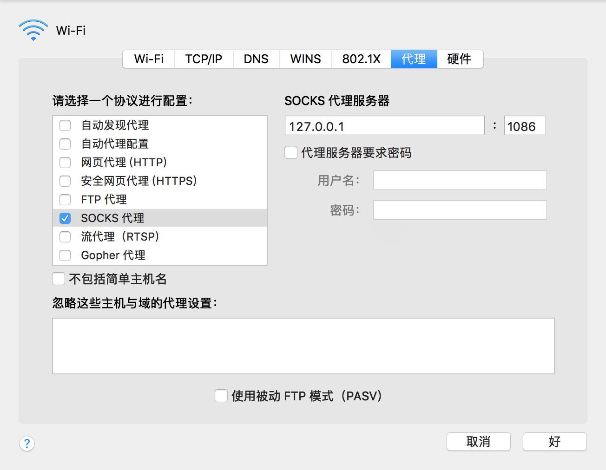

# Simple-Socks5 #

## Introduction ##

`simple-socks5` is a simple implementation of socks5 proxy server from scratch, based on `netty`.

You can test it using `cURL` and browser.

## 说明 ##

`simple-socks5`是一个基于`netty`的，从零开始实现的socks5协议的代理服务器。

可以使用`cURL`和浏览器来进行测试。

## Start proxy server ##

    mvn clean compile exec:java -Dport=1086
    
## Test proxy server ##

- use cURl

    
    curl --socks5 127.0.0.1:1086 http://threelambda.com
    
- use browser

  设置socks5代理
  
  
 
  日志
  
    23:02:59.359 [nioEventLoopGroup-3-2] INFO  c.t.socks5.Socks5ServerHandler - distAddr=www.google.com, distPort=443
    23:03:00.281 [nioEventLoopGroup-3-4] INFO  c.t.socks5.Socks5ServerHandler - version=5, cmd=1, rsv=0, atyp=3
    23:03:00.281 [nioEventLoopGroup-3-4] INFO  c.t.socks5.Socks5ServerHandler - distAddr=www.baidu.com, distPort=443
    23:03:00.281 [nioEventLoopGroup-3-3] INFO  c.t.socks5.Socks5ServerHandler - version=5, cmd=1, rsv=0, atyp=3
    23:03:00.281 [nioEventLoopGroup-3-6] INFO  c.t.socks5.Socks5ServerHandler - version=5, cmd=1, rsv=0, atyp=3
    23:03:00.280 [nioEventLoopGroup-3-5] INFO  c.t.socks5.Socks5ServerHandler - version=5, cmd=1, rsv=0, atyp=3
    23:03:00.282 [nioEventLoopGroup-3-3] INFO  c.t.socks5.Socks5ServerHandler - distAddr=www.baidu.com, distPort=443
    23:03:00.282 [nioEventLoopGroup-3-8] INFO  c.t.socks5.Socks5ServerHandler - version=5, cmd=1, rsv=0, atyp=3
    23:03:00.283 [nioEventLoopGroup-3-8] INFO  c.t.socks5.Socks5ServerHandler - distAddr=ss0.baidu.com, distPort=443
    23:03:00.283 [nioEventLoopGroup-3-5] INFO  c.t.socks5.Socks5ServerHandler - distAddr=sp1.baidu.com, distPort=443
    23:03:00.283 [nioEventLoopGroup-3-7] INFO  c.t.socks5.Socks5ServerHandler - version=5, cmd=1, rsv=0, atyp=3
